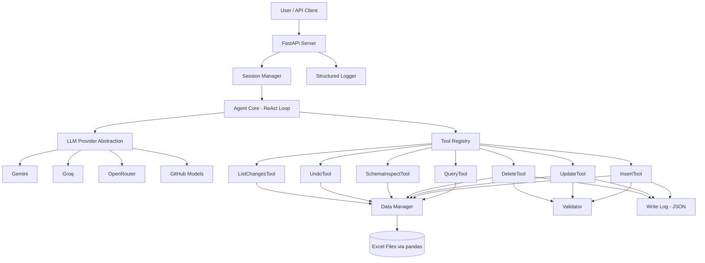

# AI Agent Excel Assistant — Implementation Plan

## Overview

Build a custom AI agent system from scratch (no LangChain/LlamaIndex) that lets users interact with two Excel datasets (**Real Estate Listings** — 1000 rows, 11 columns; **Marketing Campaigns** — 1000 rows, 11 columns) via natural language. The system uses a tool-based architecture with FastAPI, supports multiple free LLM providers, and includes undo, validation, preview+confirmation, session memory, and structured logging.

## Data Summary

| Dataset | Rows | ID Column | Key Columns | Special Types |
|---------|------|-----------|-------------|---------------|
| Real Estate Listings | 1000 | `Listing ID` (LST-XXXX) | Property Type, City, State, Bedrooms, Bathrooms, Sq Ft, Year Built, List Price, Sale Price, Status | All string/int/float |
| Marketing Campaigns | 1000 | `Campaign ID` (CMP-XXXX) | Campaign Name, Channel, Start/End Date, Budget, Spent, Impressions, Clicks, Conversions, Revenue | `Start Date` / `End Date` are `datetime` |

---

## Architecture



## Project Structure

```
Junior-AI-Engineer-Task-AI-assistant/
├── app/
│   ├── __init__.py
│   ├── main.py                  # FastAPI app entry point
│   ├── config.py                # Settings, env vars, model config
│   ├── agent/
│   │   ├── __init__.py
│   │   ├── core.py              # Agent ReAct loop & orchestration
│   │   ├── prompt.py            # System prompts & prompt templates
│   │   └── session.py           # Session memory & conversation history
│   ├── llm/
│   │   ├── __init__.py
│   │   ├── base.py              # Abstract LLM provider interface
│   │   ├── gemini.py            # Google Gemini provider
│   │   ├── groq.py              # Groq provider
│   │   ├── openrouter.py        # OpenRouter provider
│   │   └── github_models.py     # GitHub Models (OpenAI-compatible)
│   ├── tools/
│   │   ├── __init__.py
│   │   ├── base.py              # BaseTool abstract class & ToolRegistry
│   │   ├── query.py             # QueryTool - filter, aggregate, search
│   │   ├── insert.py            # InsertTool - add new rows
│   │   ├── update.py            # UpdateTool - modify existing rows
│   │   ├── delete.py            # DeleteTool - remove rows
│   │   ├── schema_inspect.py    # SchemaInspectTool - describe datasets
│   │   ├── undo.py              # UndoTool - revert mutations
│   │   └── list_changes.py      # ListChangesTool - show mutation history
│   ├── data/
│   │   ├── __init__.py
│   │   ├── manager.py           # DataManager - load/save Excel, in-memory cache
│   │   └── validator.py         # Validation logic for mutations
│   └── logging/
│       ├── __init__.py
│       └── logger.py            # Structured JSON logger
├── data/
│   ├── Real Estate Listings.xlsx
│   ├── Marketing Campaigns.xlsx
│   └── write_log.json           # Mutation log (auto-created)
├── logs/                        # Structured interaction logs (auto-created)
├── notebooks/
│   └── experimentation.ipynb    # Full workflow demo notebook
├── .env.example                 # Template for API keys
├── .gitignore
├── requirements.txt
├── README.md
├── DECISIONS.md
└── Task.txt
```

---

## Proposed Changes

### 1. Configuration & Dependencies

#### [NEW] [requirements.txt](file:///d:/Moaz/Junior-AI-Engineer-Task-AI-assistant/requirements.txt)

```
fastapi>=0.115.0
uvicorn>=0.30.0
pandas>=2.2.0
openpyxl>=3.1.0
httpx>=0.27.0
python-dotenv>=1.0.0
google-generativeai>=0.8.0
pydantic>=2.0.0
```

- `httpx` for async HTTP calls to LLM APIs (Groq, OpenRouter, GitHub Models)
- `google-generativeai` for Gemini free tier
- No LangChain, no agent frameworks — everything custom

#### [NEW] [.env.example](file:///d:/Moaz/Junior-AI-Engineer-Task-AI-assistant/.env.example)

```env
# At least one LLM provider key required
GEMINI_API_KEY=
GROQ_API_KEY=
OPENROUTER_API_KEY=
GITHUB_TOKEN=

# Active provider: gemini | groq | openrouter | github_models
LLM_PROVIDER=gemini
LLM_MODEL=gemini-2.0-flash
```

#### [NEW] [app/config.py](file:///d:/Moaz/Junior-AI-Engineer-Task-AI-assistant/app/config.py)

- Pydantic `Settings` class loading from `.env`
- Provider enum, model name, data file paths
- Validation to ensure at least one API key is configured

---

### 2. LLM Abstraction Layer

#### [NEW] [app/llm/base.py](file:///d:/Moaz/Junior-AI-Engineer-Task-AI-assistant/app/llm/base.py)

Abstract base class:

```python
class BaseLLMProvider(ABC):
    @abstractmethod
    async def generate(self, messages: list[dict], tools: list[dict] | None = None) -> LLMResponse:
        """Send messages + tool schemas, get structured response back."""
        ...
```

`LLMResponse` dataclass with: `content: str`, `tool_calls: list[ToolCall] | None`, `usage: dict`

Factory function `get_provider(provider_name: str) -> BaseLLMProvider`

**Design Decision**: All providers normalize to the same OpenAI-style message format internally. Tool schemas follow a unified JSON schema format. The agent never knows which provider is active.

#### [NEW] [app/llm/gemini.py](file:///d:/Moaz/Junior-AI-Engineer-Task-AI-assistant/app/llm/gemini.py)

- Uses `google-generativeai` SDK
- Maps our unified tool schema → Gemini function declarations
- Maps Gemini response → our `LLMResponse`
- Default model: `gemini-2.0-flash` (free, fast, supports function calling)

#### [NEW] [app/llm/groq.py](file:///d:/Moaz/Junior-AI-Engineer-Task-AI-assistant/app/llm/groq.py)

- Uses `httpx` to call Groq's OpenAI-compatible API
- Endpoint: `https://api.groq.com/openai/v1/chat/completions`
- Default model: `llama-3.3-70b-versatile` (free, supports function calling)

#### [NEW] [app/llm/openrouter.py](file:///d:/Moaz/Junior-AI-Engineer-Task-AI-assistant/app/llm/openrouter.py)

- Uses `httpx` to call OpenRouter's OpenAI-compatible API
- Endpoint: `https://openrouter.ai/api/v1/chat/completions`
- Default model: `google/gemini-2.0-flash-exp:free`

#### [NEW] [app/llm/github_models.py](file:///d:/Moaz/Junior-AI-Engineer-Task-AI-assistant/app/llm/github_models.py)

- Uses `httpx` with base URL `https://models.inference.ai.azure.com`
- OpenAI-compatible endpoint, uses GitHub PAT as bearer token
- Default model: `gpt-4o`

---

### 3. Data Manager & Validator

#### [NEW] [app/data/manager.py](file:///d:/Moaz/Junior-AI-Engineer-Task-AI-assistant/app/data/manager.py)

Core responsibilities:
- Load both Excel files into pandas DataFrames on startup
- Provide methods: `query()`, `insert_rows()`, `update_rows()`, `delete_rows()`
- Save back to Excel after mutations
- Thread-safe with a simple lock
- `get_schema(dataset)` returns column names, types, sample values, distinct values for categorical columns
- Normalize column names for resilient matching

**Dataset Alias Mapping**: Maps natural names ("real estate", "listings", "properties", "marketing", "campaigns") to the actual dataset key.

#### [NEW] [app/data/validator.py](file:///d:/Moaz/Junior-AI-Engineer-Task-AI-assistant/app/data/validator.py)

Validation rules engine:
- **Type checking**: Ensure values match column types (int, float, str, datetime)
- **Date parsing**: Flexible date format support with clear error messages
- **Required fields**: ID columns are always required for insert
- **Range constraints**: Prices > 0, bedrooms/bathrooms ≥ 0, year built 1800–current year, dates in valid ranges
- **Enum constraints**: Property Type must be in {House, Condo, Apartment, Townhouse}, Channel must be in {Facebook, Instagram, LinkedIn, Google Ads, Email}, Status in {Active, Pending, Sold}
- Returns `ValidationResult` with `is_valid`, `errors: list[str]`, `warnings: list[str]`

---

### 4. Tool System

#### [NEW] [app/tools/base.py](file:///d:/Moaz/Junior-AI-Engineer-Task-AI-assistant/app/tools/base.py)

```python
class BaseTool(ABC):
    name: str
    description: str
    parameters: dict  # JSON Schema for the tool's parameters
    
    @abstractmethod
    def execute(self, **kwargs) -> ToolResult:
        ...

class ToolRegistry:
    """Register and lookup tools by name. Generates tool schemas for the LLM."""
    def register(self, tool: BaseTool): ...
    def get(self, name: str) -> BaseTool: ...
    def get_schemas(self) -> list[dict]: ...
```

`ToolResult` dataclass: `success: bool`, `data: Any`, `message: str`, `requires_confirmation: bool`, `preview: str | None`

#### [NEW] [app/tools/query.py](file:///d:/Moaz/Junior-AI-Engineer-Task-AI-assistant/app/tools/query.py) — `QueryTool`

- **Parameters**: `dataset` (required), `filters` (list of conditions), `columns` (which to return), `sort_by`, `sort_order`, `limit`, `aggregation` (count, sum, avg, min, max, group_by)
- Handles complex queries: "average price of 3-bedroom houses in Washington", "top 5 campaigns by revenue", "listings sold above $500k"
- Returns formatted table string or summary

#### [NEW] [app/tools/insert.py](file:///d:/Moaz/Junior-AI-Engineer-Task-AI-assistant/app/tools/insert.py) — `InsertTool`

- **Parameters**: `dataset`, `rows` (list of row dicts)
- Validates via `Validator` → returns errors if invalid
- If valid, returns `preview` of rows to be inserted + `requires_confirmation=True`
- On confirmation: inserts, logs to write-log, saves Excel

#### [NEW] [app/tools/update.py](file:///d:/Moaz/Junior-AI-Engineer-Task-AI-assistant/app/tools/update.py) — `UpdateTool`

- **Parameters**: `dataset`, `filters` (to identify rows), `updates` (dict of column→new_value)
- Validates new values
- Generates before/after preview showing affected rows
- Returns `requires_confirmation=True`
- On confirmation: applies updates, logs old→new values, saves

#### [NEW] [app/tools/delete.py](file:///d:/Moaz/Junior-AI-Engineer-Task-AI-assistant/app/tools/delete.py) — `DeleteTool`

- **Parameters**: `dataset`, `filters` (to identify rows)
- Shows preview of rows to be deleted
- Returns `requires_confirmation=True`
- On confirmation: removes rows, logs deleted rows, saves

#### [NEW] [app/tools/schema_inspect.py](file:///d:/Moaz/Junior-AI-Engineer-Task-AI-assistant/app/tools/schema_inspect.py) — `SchemaInspectTool`

- **Parameters**: `dataset` (optional — if omitted, lists all datasets)
- Returns: column names, data types, row count, sample values, unique values for categoricals
- Used by agent to understand data before querying

#### [NEW] [app/tools/undo.py](file:///d:/Moaz/Junior-AI-Engineer-Task-AI-assistant/app/tools/undo.py) — `UndoTool`

- **Parameters**: `action_id` (optional — specific entry to undo), `latest` (bool — undo most recent)
- Reads write-log, generates preview of revert (current vs. restored)
- Returns `requires_confirmation=True`
- On confirmation: reverts data, appends "undo" entry to log

#### [NEW] [app/tools/list_changes.py](file:///d:/Moaz/Junior-AI-Engineer-Task-AI-assistant/app/tools/list_changes.py) — `ListChangesTool`

- **Parameters**: `dataset` (optional filter), `limit` (default 10)
- Returns formatted list of recent mutations from write-log

---

### 5. Agent Core (ReAct Loop)

#### [NEW] [app/agent/core.py](file:///d:/Moaz/Junior-AI-Engineer-Task-AI-assistant/app/agent/core.py)

The agent follows a **ReAct** (Reason + Act) pattern:

```
1. User sends query
2. Agent receives query + conversation history + tool schemas
3. LLM reasons about what to do → selects tool + parameters (or answers directly)
4. Agent executes tool → gets result
5. If tool requires confirmation → return preview to user, wait for yes/no
6. If more steps needed → feed result back to LLM, repeat from step 3
7. LLM generates final human-readable answer
8. Return answer with full reasoning trace
```

**Key Design Details**:
- Max iterations: 5 (prevents infinite loops)
- Each step is recorded in a `ReasoningStep` dataclass
- The agent exposes: `reasoning_steps`, `tool_calls`, `final_answer`
- Pending confirmations are tracked per session

```python
class AgentResponse:
    reasoning_steps: list[ReasoningStep]
    tool_calls: list[ToolCallRecord]
    final_answer: str
    requires_confirmation: bool
    confirmation_preview: str | None
    session_id: str
```

#### [NEW] [app/agent/prompt.py](file:///d:/Moaz/Junior-AI-Engineer-Task-AI-assistant/app/agent/prompt.py)

System prompt that:
- Describes the agent's role and capabilities
- Lists available datasets with schemas (injected dynamically)
- Instructs to use `schema_inspect` tool first if unsure about data
- Instructs step-by-step reasoning
- Instructs to always use tools for data operations (never guess data)
- Includes examples of good tool usage

#### [NEW] [app/agent/session.py](file:///d:/Moaz/Junior-AI-Engineer-Task-AI-assistant/app/agent/session.py)

- `SessionManager` with in-memory dict of sessions
- Each session: `session_id`, `conversation_history: list[Message]`, `pending_confirmation: dict | None`, `created_at`, `last_active`
- Auto-cleanup of stale sessions (configurable TTL)
- Conversation history is trimmed to last N messages to manage context window

---

### 6. Write Log (Undo Mechanism)

#### Stored in [data/write_log.json](file:///d:/Moaz/Junior-AI-Engineer-Task-AI-assistant/data/write_log.json)

```json
[
  {
    "action_id": "act_001",
    "timestamp": "2026-04-22T01:00:00Z",
    "operation": "update",
    "dataset": "real_estate_listings",
    "affected_rows": [
      {
        "row_id": "LST-5001",
        "changes": {
          "List Price": {"before": 351000, "after": 482000}
        }
      }
    ],
    "undone": false
  }
]
```

---

### 7. FastAPI Server

#### [NEW] [app/main.py](file:///d:/Moaz/Junior-AI-Engineer-Task-AI-assistant/app/main.py)

**Endpoints**:

| Method | Path | Description |
|--------|------|-------------|
| `POST` | `/chat` | Main chat endpoint — send message, get agent response |
| `POST` | `/chat/confirm` | Confirm or reject a pending mutation |
| `GET` | `/sessions/{id}/history` | Get conversation history for a session |
| `DELETE` | `/sessions/{id}` | Delete a session |
| `GET` | `/health` | Health check |
| `GET` | `/datasets` | List available datasets with schemas |

**Chat Request**:
```json
{
  "message": "Show me the top 5 most expensive houses in Washington",
  "session_id": "optional-uuid"
}
```

**Chat Response**:
```json
{
  "session_id": "uuid",
  "response": "Here are the top 5...",
  "reasoning_steps": [
    {"step": 1, "thought": "User wants expensive houses in WA...", "action": "query", "input": {...}, "output": "..."}
  ],
  "requires_confirmation": false,
  "confirmation_preview": null
}
```

**Confirmation Request**:
```json
{
  "session_id": "uuid",
  "confirmed": true
}
```

---

### 8. Structured Logging

#### [NEW] [app/logging/logger.py](file:///d:/Moaz/Junior-AI-Engineer-Task-AI-assistant/app/logging/logger.py)

Each interaction logged as JSON to `logs/` directory:

```json
{
  "interaction_id": "uuid",
  "session_id": "uuid",
  "timestamp": "2026-04-22T01:00:00Z",
  "user_query": "...",
  "reasoning_steps": [...],
  "tool_decisions": [...],
  "tool_inputs": [...],
  "tool_outputs": [...],
  "final_response": "...",
  "llm_provider": "gemini",
  "llm_model": "gemini-2.0-flash",
  "latency_ms": 1234,
  "error": null
}
```

---

### 9. Experimentation Notebook

#### [NEW] [notebooks/experimentation.ipynb](file:///d:/Moaz/Junior-AI-Engineer-Task-AI-assistant/notebooks/experimentation.ipynb)

Demonstrates:
1. Loading and exploring data
2. Defining tools individually
3. Building the agent
4. Test scenarios:
   - Simple query: "How many listings are in California?"
   - Complex query: "Average sale price by property type in Washington"
   - Schema inspection: "What data do you have?"
   - Insert with validation: Adding a new listing
   - Update with preview: Changing a listing price
   - Delete with confirmation: Removing a campaign
   - Undo: Reverting the last change
   - Multi-turn conversation: Follow-up questions
   - Error handling: Invalid data types, missing fields

---

### 10. Documentation

#### [MODIFY] [README.md](file:///d:/Moaz/Junior-AI-Engineer-Task-AI-assistant/README.md)

Complete documentation covering:
- Project overview and features
- Architecture diagram
- Quick start (setup, install, configure, run)
- API reference with examples
- Tool descriptions
- Usage examples (curl commands)
- Configuration options

#### [NEW] [DECISIONS.md](file:///d:/Moaz/Junior-AI-Engineer-Task-AI-assistant/DECISIONS.md)

Design decisions covering:
- Why ReAct pattern over simple prompt-response
- Why pandas over raw openpyxl for data operations
- Why in-memory caching with write-through to Excel
- Why JSON write-log over database for undo
- Tool granularity decisions (7 tools vs. fewer/more)
- LLM abstraction design — why OpenAI-compatible as common format
- Session management — in-memory vs. persistent
- Validation strategy — fail-fast with clear errors
- Preview + confirmation — building user trust
- Tradeoffs and what could be improved

---

## Open Questions

> [!IMPORTANT]
> **LLM Provider Preference**: Which LLM provider do you currently have API keys for? I'll set that as the default. Gemini free tier is the easiest to get started with (free, fast, good function calling support).

> [!NOTE]
> **Data File Location**: The Excel files are currently in the project root. I'll copy them to a `data/` subdirectory for cleaner organization while keeping the originals in the root. Is that okay?

---

## Verification Plan

### Automated Tests
1. Start the FastAPI server with `uvicorn app.main:app`
2. Test all endpoints via browser-based interaction:
   - Query: "How many listings are in California?"
   - Query: "Top 5 campaigns by revenue"
   - Schema: "What datasets are available?"
   - Update with preview + confirmation flow
   - Insert with validation (valid + invalid data)
   - Delete with confirmation
   - Undo last change
   - List changes
   - Multi-turn conversation
3. Verify structured logs are written correctly
4. Verify write-log tracks all mutations

### Manual Verification
- Run the experimentation notebook end-to-end
- Verify Excel files are properly updated after mutations
- Test switching between LLM providers
- Review README.md for completeness
